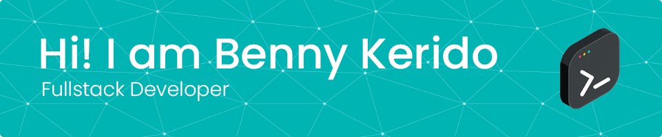

[](https://www.bento.me/bennykerido)&nbsp;[](https://www.buymeacoffee.com/bennykerido)
<!--START_SECTION:waka-->


**🐱 My GitHub Data** 

> 📦 216.9 kB Used in GitHub's Storage 
 > 
> 🏆 0 Contributions in the Year 2024
 > 
> 🚫 Not Opted to Hire
 > 
> 📜 10 Public Repositories 
 > 
> 🔑 41 Private Repositories 
 > 
**I'm a Night 🦉** 

```text
🌞 Morning                194 commits         ███░░░░░░░░░░░░░░░░░░░░░░   10.09 % 
🌆 Daytime                667 commits         █████████░░░░░░░░░░░░░░░░   34.69 % 
🌃 Evening                891 commits         ████████████░░░░░░░░░░░░░   46.33 % 
🌙 Night                  171 commits         ██░░░░░░░░░░░░░░░░░░░░░░░   08.89 % 
```
📅 **I'm Most Productive on Sunday** 

```text
Monday                   298 commits         ████░░░░░░░░░░░░░░░░░░░░░   15.50 % 
Tuesday                  233 commits         ███░░░░░░░░░░░░░░░░░░░░░░   12.12 % 
Wednesday                158 commits         ██░░░░░░░░░░░░░░░░░░░░░░░   08.22 % 
Thursday                 185 commits         ██░░░░░░░░░░░░░░░░░░░░░░░   09.62 % 
Friday                   252 commits         ███░░░░░░░░░░░░░░░░░░░░░░   13.10 % 
Saturday                 395 commits         █████░░░░░░░░░░░░░░░░░░░░   20.54 % 
Sunday                   402 commits         █████░░░░░░░░░░░░░░░░░░░░   20.90 % 
```


📊 **This Week I Spent My Time On** 

```text
🕑︎ Time Zone: Asia/Jerusalem

💬 Programming Languages: 
JavaScript               12 hrs 35 mins      ████████████████░░░░░░░░░   65.32 % 
TypeScript               4 hrs 6 mins        █████░░░░░░░░░░░░░░░░░░░░   21.28 % 
SCSS                     2 hrs 1 min         ███░░░░░░░░░░░░░░░░░░░░░░   10.54 % 
Groovy                   12 mins             ░░░░░░░░░░░░░░░░░░░░░░░░░   01.11 % 
JSON                     12 mins             ░░░░░░░░░░░░░░░░░░░░░░░░░   01.07 % 

🔥 Editors: 
WebStorm                 19 hrs 17 mins      █████████████████████████   100.00 % 

💻 Operating System: 
Mac                      19 hrs 17 mins      █████████████████████████   100.00 % 
```

**I Mostly Code in JavaScript** 

```text
JavaScript               22 repos            ███████████░░░░░░░░░░░░░░   44.00 % 
TypeScript               13 repos            ██████░░░░░░░░░░░░░░░░░░░   26.00 % 
Python                   3 repos             ██░░░░░░░░░░░░░░░░░░░░░░░   06.00 % 
SCSS                     2 repos             █░░░░░░░░░░░░░░░░░░░░░░░░   04.00 % 
HTML                     1 repo              ░░░░░░░░░░░░░░░░░░░░░░░░░   02.00 % 
```


**Timeline**


 Last Updated on 17/08/2024 18:37:13 UTC
<!--END_SECTION:waka-->
#### Skills:
[](https://skillicons.dev)

#### Tools:
[](https://skillicons.dev)

#### Other:
[](https://skillicons.dev)

#### Social:
[](https://www.instagram.com/bennykerido)
[](https://www.linkedin.com/in/bennykerido)
[](https://www.github.com/bennykerido)

<br/>
<br/>

<a href="https://github.com/bennykerido">
  
</a>
<a href="https://github.com/bennykerido">
  
</a>

